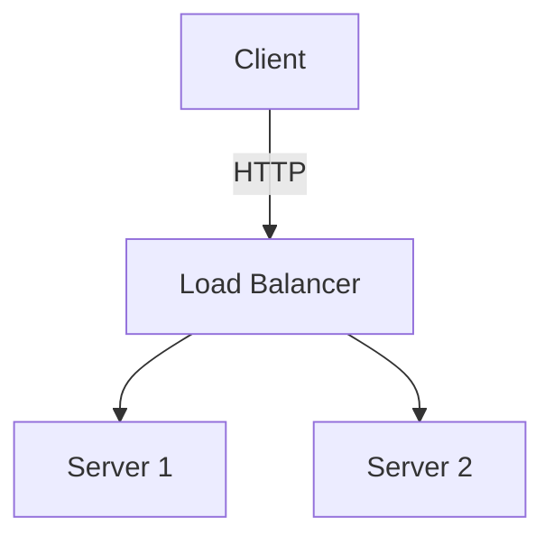

# ADR-001: Mermaid Diagram Rendering via HTML Macro with Latest Version

## Status

Proposed

## Context

### Problem

Confluence Server's built-in Mermaid support (via the `{markdown}` macro) uses an outdated version (approximately 9.x). This limits users to older Mermaid syntax and features, preventing them from using:

- Newer diagram types (e.g., mindmaps, timeline, quadrant charts)
- Modern syntax improvements
- Bug fixes and security patches available in recent versions
- Custom themes and configurations

### Current Implementation

Currently, mermaid code blocks are converted as follows:

1. **Wiki Markup Format**: Wrapped in `{markdown}` macro
   ```
   {markdown}
   ```mermaid
   graph TD;
     A-->B;
   ```
   {markdown}
   ```

2. **ADF Format**: Uses code block with `mermaid` language
   ```json
   {
     "type": "codeBlock",
     "attrs": { "language": "mermaid" },
     "content": [{ "type": "text", "text": "graph TD;\n  A-->B;" }]
   }
   ```

Both approaches rely on Confluence's built-in rendering, which uses an old Mermaid version.

### Opportunity

Confluence supports an **HTML macro** that can execute custom JavaScript. By using this, we can:

1. Load the latest Mermaid.js from a CDN
2. Render diagrams client-side with full feature support
3. Allow custom configuration (themes, security settings, etc.)

## Decision

We will implement a new `mermaidFormat` option that supports rendering Mermaid diagrams via the HTML macro with a configurable Mermaid.js version.

### New Configuration Options

```typescript
interface ConversionOptions {
  // ... existing options ...

  // Mermaid rendering format
  // - 'native': Use Confluence's built-in rendering (current behavior)
  // - 'html': Use HTML macro with CDN-loaded Mermaid.js
  mermaidFormat?: 'native' | 'html';

  // Mermaid.js version for CDN (only used when mermaidFormat='html')
  // Default: '11' (latest major version)
  mermaidVersion?: string;

  // Mermaid theme (only used when mermaidFormat='html')
  // Options: 'default', 'dark', 'forest', 'neutral', 'base'
  mermaidTheme?: 'default' | 'dark' | 'forest' | 'neutral' | 'base';

  // Custom Mermaid initialization config (JSON object)
  mermaidConfig?: Record<string, unknown>;
}
```

### HTML Template for Mermaid Rendering

```html
<div class="mermaid-container" id="mermaid-{{uniqueId}}">
  <pre class="mermaid">
{{mermaidCode}}
  </pre>
</div>
<script>
(function() {
  // Check if Mermaid is already loaded
  if (typeof mermaid === 'undefined') {
    // Load Mermaid from CDN
    var script = document.createElement('script');
    script.src = 'https://cdn.jsdelivr.net/npm/mermaid@{{version}}/dist/mermaid.min.js';
    script.onload = function() {
      mermaid.initialize({
        startOnLoad: false,
        theme: '{{theme}}',
        securityLevel: 'loose',
        {{customConfig}}
      });
      mermaid.run({
        querySelector: '#mermaid-{{uniqueId}} .mermaid'
      });
    };
    document.head.appendChild(script);
  } else {
    // Mermaid already loaded, just render
    mermaid.run({
      querySelector: '#mermaid-{{uniqueId}} .mermaid'
    });
  }
})();
</script>
```

### Implementation Locations

1. **`src/converter.ts`**: Update `tokenToADFNode` for code blocks to handle mermaid with new format
2. **`src/markdown-to-wiki.ts`**: Update `convertCodeBlock` to generate HTML macro for mermaid
3. **`src/confluence.ts`**: Update ADF to storage format conversion for mermaid HTML macros
4. **`src/cli.ts`**: Add CLI options for mermaid configuration
5. **New file `src/mermaid-html.ts`**: Dedicated module for HTML template generation

### Usage Examples

#### CLI Usage

```bash
# Use latest Mermaid via HTML macro
doc2conf push docs/diagram.md --mermaid-format html

# Specify Mermaid version and theme
doc2conf push docs/diagram.md --mermaid-format html --mermaid-version 11 --mermaid-theme dark

# Use custom config
doc2conf push docs/diagram.md --mermaid-format html --mermaid-config '{"flowchart":{"curve":"basis"}}'
```

#### Frontmatter Configuration

```yaml
---
title: My Diagram Page
mermaidFormat: html
mermaidVersion: "11"
mermaidTheme: forest
mermaidConfig:
  flowchart:
    curve: basis
  themeVariables:
    primaryColor: "#ff0000"
---

# Architecture Diagram


```

#### Programmatic API

```typescript
import { Converter } from 'doc2confluence';

const converter = new Converter();
const adf = await converter.convertToADF(markdown, {
  mermaidFormat: 'html',
  mermaidVersion: '11',
  mermaidTheme: 'dark',
  mermaidConfig: {
    flowchart: { curve: 'basis' }
  }
});
```

## Consequences

### Positive

1. **Access to Latest Features**: Users can utilize all modern Mermaid diagram types and syntax
2. **Customization**: Full control over theme, styling, and configuration
3. **Security Updates**: Ability to use patched versions without waiting for Confluence updates
4. **Backward Compatible**: Default behavior remains unchanged (`mermaidFormat: 'native'`)
5. **Flexibility**: Version can be pinned for reproducibility or set to latest

### Negative

1. **CDN Dependency**: Requires network access to CDN at page view time (unless self-hosted)
2. **Client-Side Rendering**: Diagrams render in browser rather than server-side
3. **HTML Macro Requirement**: Target Confluence instance must have HTML macro enabled
4. **Slightly Larger Page Size**: Additional JavaScript loading per page with diagrams

### Mitigations

1. **CDN Caching**: jsdelivr provides excellent caching and availability
2. **Loading States**: Add CSS to show loading placeholder while script loads
3. **Fallback Option**: Document how to self-host Mermaid.js for restricted environments
4. **Deduplication**: Script loading is deduplicated when multiple diagrams exist on same page

## Alternatives Considered

### 1. Server-Side Pre-Rendering

Convert Mermaid to SVG/PNG during the build process and embed as images.

**Rejected because**:
- Requires headless browser (Puppeteer/Playwright) adding complexity
- Loses interactivity and accessibility
- Increases build time significantly

### 2. Confluence App/Plugin

Create a custom Confluence app with updated Mermaid version.

**Rejected because**:
- Requires admin access to install
- More complex deployment
- Out of scope for this conversion tool

### 3. Self-Hosted Script via Attachment

Upload Mermaid.js as page attachment and reference it.

**Future consideration**:
- Could be added as option for environments without CDN access
- Would require additional attachment upload logic

## Implementation Plan

### Phase 1: Core Implementation

1. Create `src/mermaid-html.ts` with HTML template generation
2. Update `ConversionOptions` interface with new mermaid options
3. Implement HTML macro generation in `converter.ts`
4. Update `markdown-to-wiki.ts` for wiki markup format

### Phase 2: CLI Integration

1. Add CLI options for mermaid configuration
2. Support frontmatter configuration
3. Update configuration file schema

### Phase 3: Testing & Documentation

1. Add unit tests for HTML template generation
2. Add integration tests for full conversion pipeline
3. Update README with usage examples
4. Add example markdown files demonstrating various configurations

## References

- [Mermaid.js Documentation](https://mermaid.js.org/)
- [Mermaid.js Releases](https://github.com/mermaid-js/mermaid/releases)
- [Confluence HTML Macro](https://confluence.atlassian.com/doc/html-macro-38273085.html)
- [jsDelivr CDN](https://www.jsdelivr.com/package/npm/mermaid)
