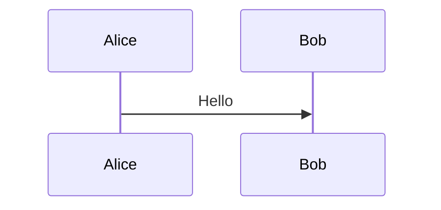

# ADR-001: Mermaid Diagram Rendering via HTML Macro with Latest Version

## Status

Accepted

## Context

### Problem

Confluence Server's built-in Mermaid support (via the `{markdown}` macro) uses an outdated version (approximately 9.x). This limits users to older Mermaid syntax and features, preventing them from using:

- Newer diagram types (e.g., mindmaps, timeline, quadrant charts)
- Modern syntax improvements
- Bug fixes and security patches available in recent versions
- Custom themes and configurations

### Current Implementation

Currently, mermaid code blocks are converted as follows:

1. **Wiki Markup Format**: Wrapped in `{markdown}` macro
   ```
   {markdown}
   ```mermaid
   graph TD;
     A-->B;
   ```
   {markdown}
   ```

2. **ADF Format**: Uses code block with `mermaid` language
   ```json
   {
     "type": "codeBlock",
     "attrs": { "language": "mermaid" },
     "content": [{ "type": "text", "text": "graph TD;\n  A-->B;" }]
   }
   ```

Both approaches rely on Confluence's built-in rendering, which uses an old Mermaid version.

### Opportunity

Confluence supports an **HTML macro** that can execute custom JavaScript. By using this, we can:

1. Load the latest Mermaid.js from a CDN
2. Re-render existing mermaid diagrams with the new version
3. Allow custom configuration (themes, security settings, etc.)

## Decision

We will implement a **Mermaid upgrade script** approach:

1. **Keep existing `{markdown}` macro** for mermaid code blocks (unchanged)
2. **Append a single `{html}` macro** at the end of the document with a script that:
   - Loads the latest Mermaid.js from CDN
   - Re-initializes and re-renders all mermaid diagrams on the page

This approach is simpler and more efficient than replacing each mermaid block individually.

### New Configuration Options

```typescript
interface ConversionOptions {
  // ... existing options ...

  // Mermaid rendering format
  // - 'native': Use Confluence's built-in rendering (current behavior)
  // - 'html': Keep {markdown} macro but append upgrade script
  mermaidFormat?: 'native' | 'html';

  // Mermaid.js version for CDN (only used when mermaidFormat='html')
  // Default: '11' (latest major version)
  mermaidVersion?: string;

  // Mermaid theme (only used when mermaidFormat='html')
  // Options: 'default', 'dark', 'forest', 'neutral', 'base'
  mermaidTheme?: 'default' | 'dark' | 'forest' | 'neutral' | 'base';

  // Custom Mermaid initialization config (JSON object)
  mermaidConfig?: Record<string, unknown>;
}
```

### Upgrade Script (appended once per page)

```html
{html}
<script>
(function() {
  // Load Mermaid.js from CDN
  var script = document.createElement('script');
  script.src = 'https://cdn.jsdelivr.net/npm/mermaid@11/dist/mermaid.min.js';
  script.onload = function() {
    // Find all mermaid blocks rendered by Confluence's markdown macro
    var mermaidBlocks = document.querySelectorAll('pre.mermaid, code.language-mermaid, .mermaid');

    // Initialize with custom config
    mermaid.initialize({
      startOnLoad: false,
      theme: 'default',
      securityLevel: 'loose'
    });

    // Re-render all mermaid diagrams with the new version
    mermaid.run({ nodes: mermaidBlocks });
  };
  document.head.appendChild(script);
})();
</script>
{html}
```

### Implementation Locations

1. **`src/mermaid-html.ts`**: Dedicated module for upgrade script generation
2. **`src/converter.ts`**: Track mermaid blocks, append upgrade script to ADF
3. **`src/markdown-to-wiki.ts`**: Track mermaid blocks, append upgrade script to wiki markup
4. **`src/cli.ts`**: Add CLI options for mermaid configuration

### Usage Examples

#### CLI Usage

```bash
# Use latest Mermaid via upgrade script
doc2conf push docs/diagram.md --mermaid-format html

# Specify Mermaid version and theme
doc2conf push docs/diagram.md --mermaid-format html --mermaid-version 11 --mermaid-theme dark

# Use custom config
doc2conf push docs/diagram.md --mermaid-format html --mermaid-config '{"flowchart":{"curve":"basis"}}'
```

#### Output Example

For a document with mermaid diagrams, when `--mermaid-format html` is used:

```
h1. My Diagram

{markdown}

{markdown}

Some text here.

{markdown}

{markdown}

{html}
<script>
// Upgrade script that loads Mermaid.js v11 and re-renders all diagrams
</script>
{html}
```

## Consequences

### Positive

1. **Simple Implementation**: Single script appended at the end, no changes to diagram blocks
2. **Access to Latest Features**: Users can utilize all modern Mermaid diagram types and syntax
3. **Customization**: Full control over theme, styling, and configuration
4. **Efficient**: One script load handles all diagrams on the page
5. **Backward Compatible**: Default behavior remains unchanged (`mermaidFormat: 'native'`)
6. **Flexibility**: Version can be pinned for reproducibility or set to latest

### Negative

1. **CDN Dependency**: Requires network access to CDN at page view time (unless self-hosted)
2. **Client-Side Rendering**: Diagrams render in browser rather than server-side
3. **HTML Macro Requirement**: Target Confluence instance must have HTML macro enabled
4. **Brief Flash**: Diagrams may briefly show old rendering before upgrade script runs

### Mitigations

1. **CDN Caching**: jsdelivr provides excellent caching and availability
2. **Delayed Execution**: Script waits for DOM ready and adds small delay for Confluence rendering
3. **Fallback Option**: Document how to self-host Mermaid.js for restricted environments
4. **Single Script**: Only one script load per page regardless of diagram count

## Alternatives Considered

### 1. Replace Each Mermaid Block with HTML

Wrap each mermaid diagram in its own `{html}` macro with embedded script.

**Rejected because**:
- More complex implementation
- Duplicate script loading logic per diagram
- Larger page size with multiple diagrams

### 2. Server-Side Pre-Rendering

Convert Mermaid to SVG/PNG during the build process and embed as images.

**Rejected because**:
- Requires headless browser (Puppeteer/Playwright) adding complexity
- Loses interactivity and accessibility
- Increases build time significantly

### 3. Confluence App/Plugin

Create a custom Confluence app with updated Mermaid version.

**Rejected because**:
- Requires admin access to install
- More complex deployment
- Out of scope for this conversion tool

## References

- [Mermaid.js Documentation](https://mermaid.js.org/)
- [Mermaid.js Releases](https://github.com/mermaid-js/mermaid/releases)
- [Confluence HTML Macro](https://confluence.atlassian.com/doc/html-macro-38273085.html)
- [jsDelivr CDN](https://www.jsdelivr.com/package/npm/mermaid)
